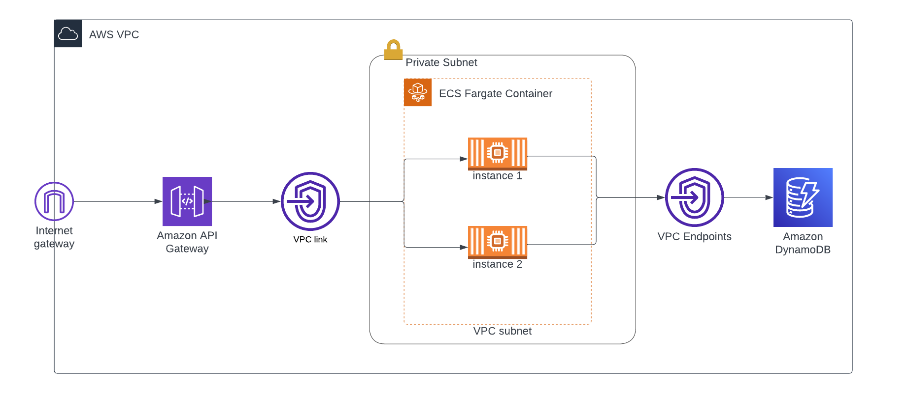

# micro-habit-tracking-api
Microservice for storing data for habit tracking api based on atomic habits. This repo will utilize AWS services for hosting the service and managing authentication

## Architecture

Services that will be used:
```JSON
- AWS Internet Gateway
- AWS API Gateway
- AWS ECS Fargate
- AWS DynamoDB
```